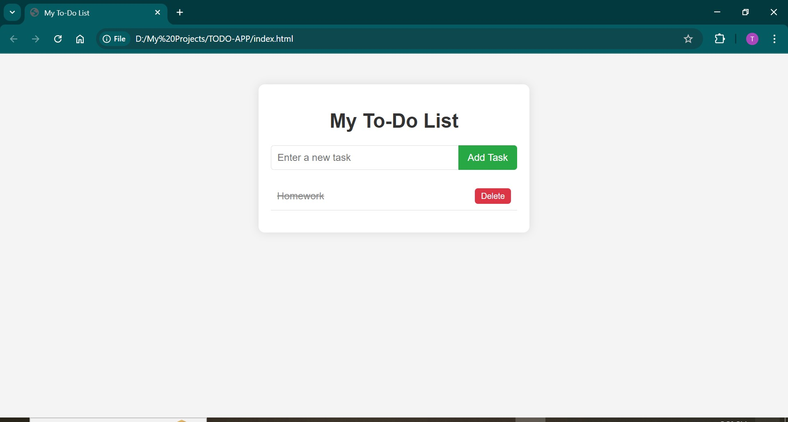

# 📝 To-Do List App
A simple web app to manage daily tasks using JavaScript and localStorage.

## 🚀 Features
- Add new tasks
- Mark tasks as completed
- Delete tasks
- Data saved in browser localStorage

## 🛠 Tech Used
- HTML
- CSS
- JavaScript

## 📌 How to Run
1. Download the project
2. Open `index.html` in browser
3. Add tasks and manage them

## 📸 Screenshot

